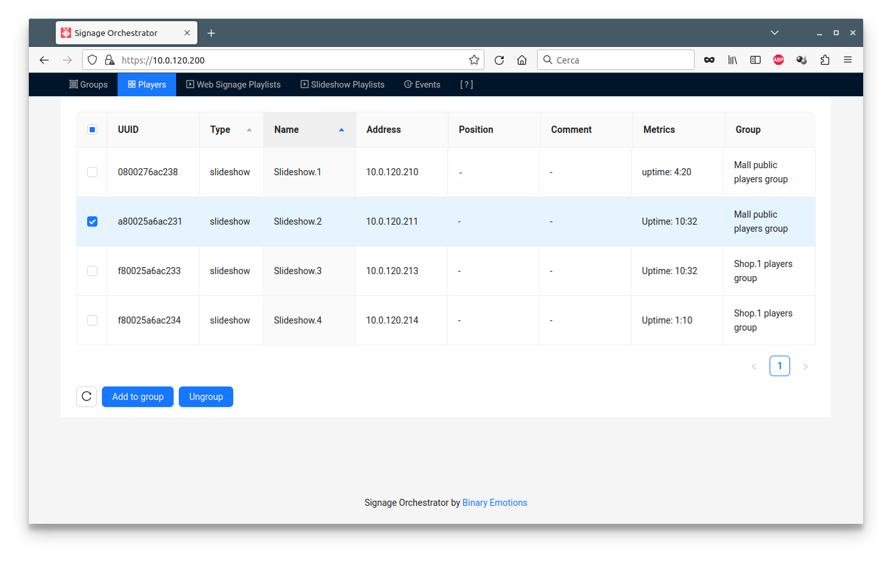
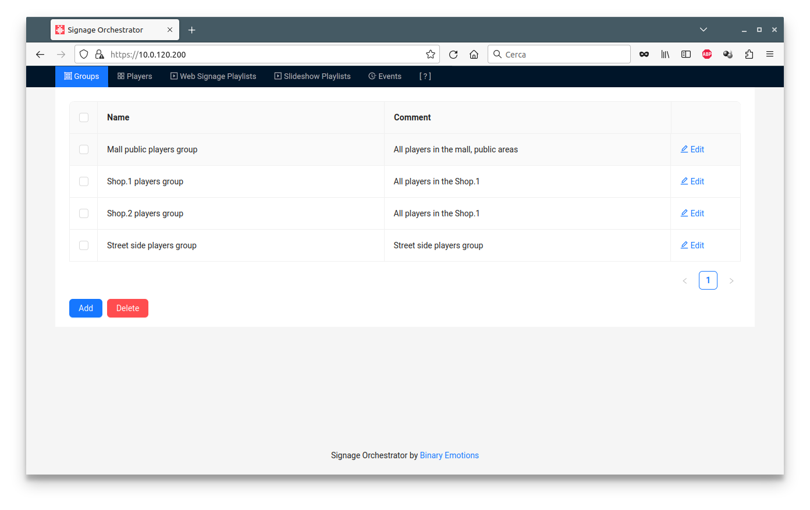
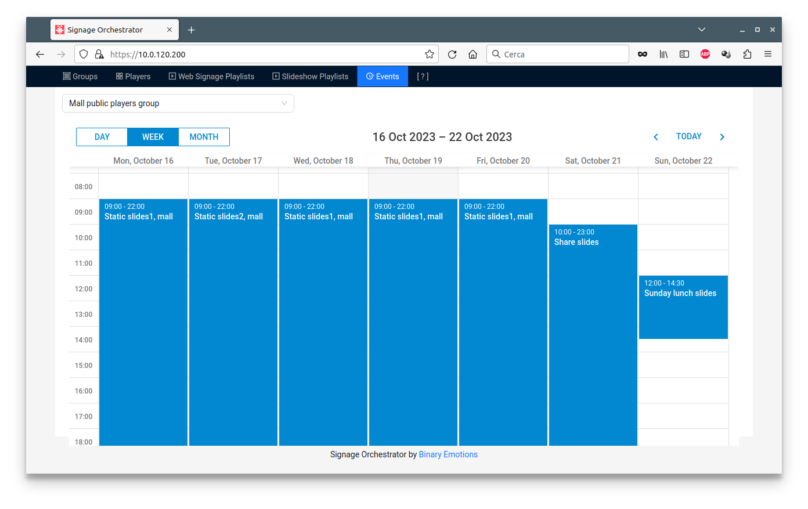
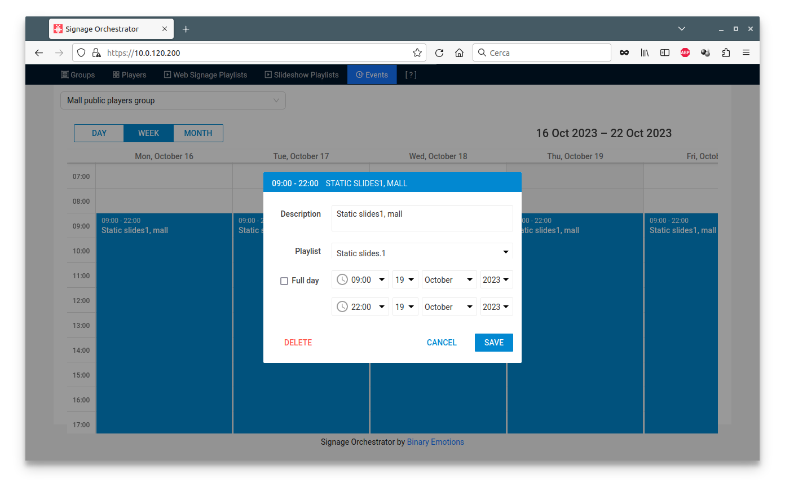
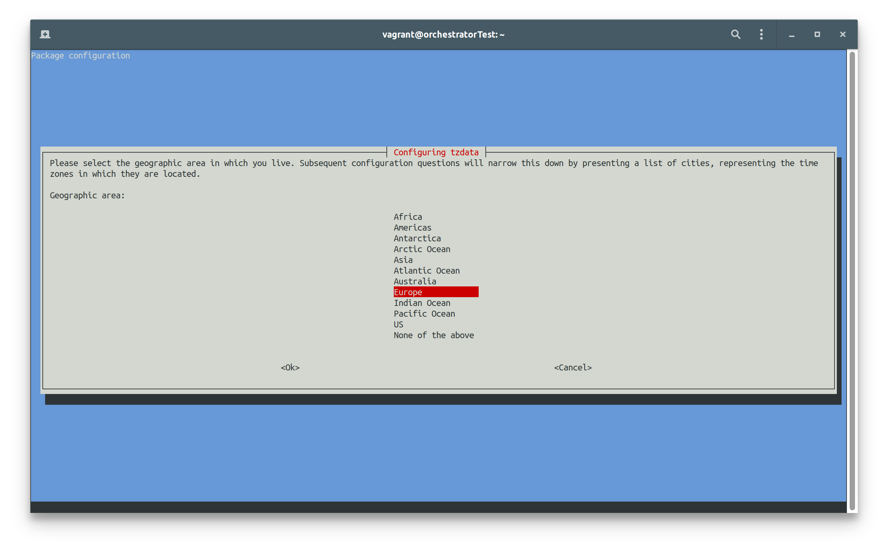
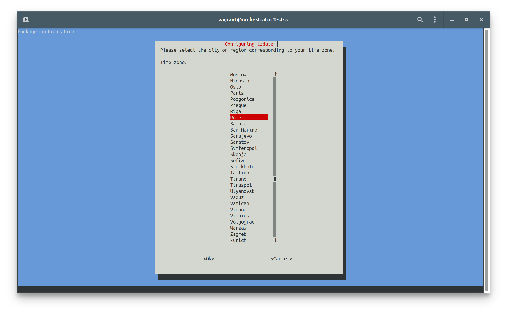
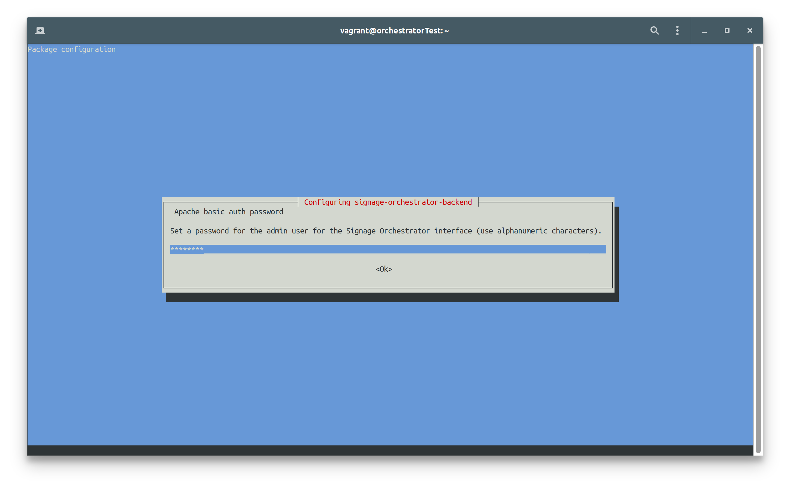

**SIGNAGE ORCHESTRATOR** 

Signage Orchestrator is a central web interface you can use to schedule Raspberry Slideshow and Raspberry Digital Signage units (“players”) to display web urls/slide media in a calendar-based timetable.

All available players are enlisted in the Players table, if configured to use the Orchestrator.

You can add each player to a Group.

Playlists are player configurations. 

Essentially, for Raspberry Slideshow a playlist is the <em>media.conf</em> directives, plus the transition and blend time of images:

In the Events tab you can schedule a group of players to use a playlist:

Please note that in the Events tab you need to select the Group, then all events related to it will be displayed.

When adding a new event, just give it a name, then click on it, use the modification icon and assign it a playlist (as in the last image here above). 

In the images, for example, all the players associated to the "Mall public players group" will be scheduled, according to the calendar, to slide their associated playlist, which can be of course different from event to event.

------------

***Installation***

A Debian 12 Bookworm operating system is needed in order to deploy Signage Orchestrator.
System must be reachable by Raspberry Slideshow/Digital Signage players, so in the same network or correctly routed.

For testing purposes, a VirtualBox virtual machine with bridged network is fine.

Once installed the operating system, SSH in as root, then give the following commands:

    apt update

    cd /root
    wget https://github.com/marco-buratto/signage-orchestrator/releases/download/v1.0/signage-orchestrator-backend_1.0-1_all.deb
    wget https://github.com/marco-buratto/signage-orchestrator/releases/download/v1.0/signage-orchestrator-ui_1.0-1_all.deb

    apt install -y /root/signage-orchestrator-*.deb

During the installation, debconf will ask you to set the timezone according to yours and to create a password for the admin user of Signage Orchestrator, in order to be able to login and connect players. The following images are shown as an example:

Please be sure the time of the operating system is always correct: configure systemd-timesyncd or install another NTP service for the purpose.

------------

***First access***

From your browser of choice, browse to the IP address of the operating system you have just installed and agree to the security warnings. 
The default installation is deployed with an autosigned certificate.

Login with *admin* as user and the password you have chosen.

By the way, Signage Orchestrator is designed with security in mind, but of course in production environments or "untrusted networks", a valid TLS certificate is needed to be installed into Apache.

